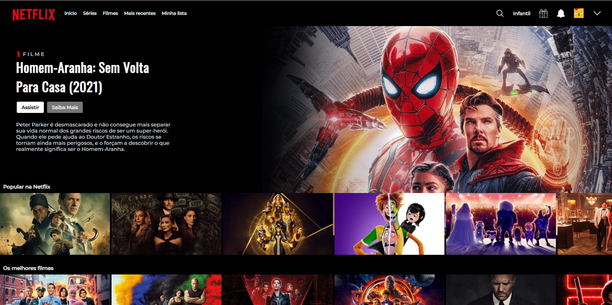

<h1 align="center"> Netflix </h1>

    

## Descrição

O projeto é um clone  da Netflix (é uma provedora global de filmes e séries de televisão via streaming sediada em Los Gatos, Califórnia) feita com html, css e js. Para o carrosel de imagens foi utilizado a biblioteca Glider.js que permite criar uma lista de rolagem nativa incrivelmente rápida, pequena, totalmente responsiva, compatível com dispositivos móveis, sem dependência e com controles de paginação.

## Status do Projeto

**Concluido**: O projeto esta terminado, não havera futuras alterações de funcionalidade.

## Construído com

* [HTML](https://www.w3schools.com/html/) - HTML abreviação para a expressão inglesa HyperText Markup Language, que significa: "Linguagem de Marcação de Hipertexto" é uma linguagem de marcação utilizada na construção de páginas na Web. Documentos HTML podem ser interpretados por navegadores. A tecnologia é fruto da junção entre os padrões HyTime e SGML.

* [CSS](https://www.w3schools.com/css/default.asp) - Cascading Style Sheets é um mecanismo para adicionar estilo a um documento web. O código CSS pode ser aplicado diretamente nas tags ou ficar contido dentro das tags "style". Também é possível, em vez de colocar a formatação dentro do documento, criar um link para um arquivo CSS que contém os estilos.

* [JavaScript](https://developer.mozilla.org/pt-BR/docs/Web/JavaScript) - CJavaScript é uma linguagem de programação interpretada estruturada, de script em alto nível com tipagem dinâmica fraca e multiparadigma. Juntamente com HTML e CSS, o JavaScript é uma das três principais tecnologias da World Wide Web.

* [Glider.js](https://nickpiscitelli.github.io/Glider.js/) - uma lista de rolagem nativa incrivelmente rápida, pequena, totalmente responsiva, compatível com dispositivos móveis, sem dependência e com controles de paginação.

## Autor

* **Emanuelly Fernandes** - *responsável pela construção e desenvolvimento do projeto*

## Licença

Este projeto está licenciado sob a licença MIT - consulte o arquivo [LICENSE.md](LICENSE.md) para obter detalhes

## Links

* [Demo](https://emanuellyfernandes.github.io/Netflix_clone/) - Link de demonstração

